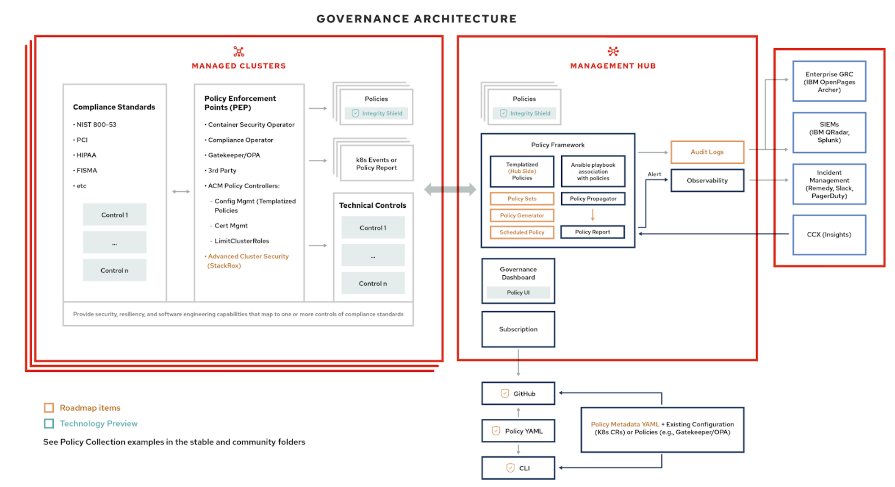
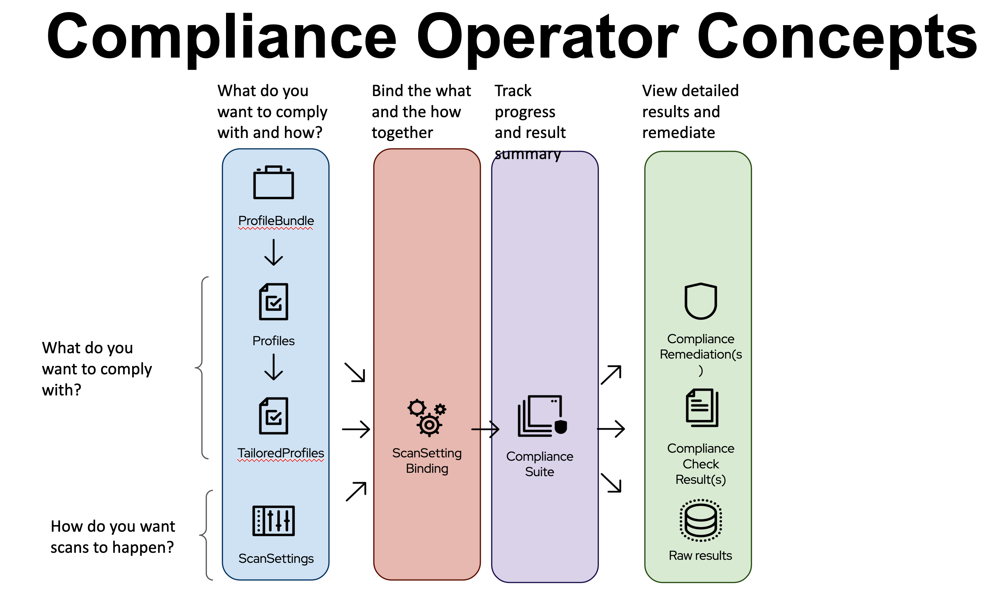
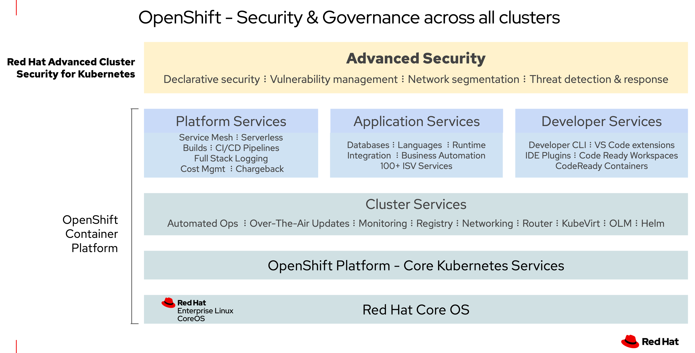

# ACS ACM Dev Conference

The "IBM Digital Developer Conference (DDC): Cloud Security" is an online conference by developers for developers to learn and build secure enterprise workloads in the open hybrid cloud. Top experts in cloud security, innovating client partners, and experienced peers in cybersecurity share their insights and learnings. 

## Overview

What are some of the challenges of security, governance and compliance in the cloud:
- Enterprise clients need to meet internal enterprise security standards as well as external regulatory compliance requirements
- Enterprise clients need to go through periodic audits by external auditors of their IT infrastructure
- Securing clouds typically requires new security tools in addition to existing security tools used for traditional non-cloud IT infrastructures
- Cloud environments are dynamic 
- Enterprises typically use more than one cloud provider
- Enterprises require interaction with existing systems of record and data
- Customers want ‘open’ not proprietary solutions 

Governance using OpenShift Plus takes advantage of the strengths found in several of Red Hat’s products.  

Red Hat Advanced Cluster Management for Kubernetes helps with cluster management, application management and also contains a policy framework that helps with configuration and governance.

---
<div style="align:center"></div>
---

OpenShift’s Compliance Operator helps you apply compliance rules to your clusters.  And using the Compliance Operator with ACM and ACS simplifies the process when handling this for many clusters.

---
<div style="align:center"></div>
---

Advanced Cluster Security provides not only deep insights into the security of your clusters, it helps you visualize and prioritize your security concerns.

---
<div style="align:center"></div>
---

Using these three products your security posture across many clusters can be well understood and managed.


## Prerequisites

ACM 2.4 is already installed on an OpenShift 4.9 cluster.  All of the resources used in this demonstration are located in this [demo repository](https://github.com/gparvin/grc-demo) in the `OpenShift-Plus` subdirectory.

- All commands that are executed must in in the context of the ACM hub cluster.
- An ACM Credential was pre-created to allow the new managed cluster to be created without having to create a new credential.
- Login to the OpenShift Container Platform web console for the ACM hub cluster and to the ACM web console
- Apply the `subscription-admin.yaml` so the user is allowed to create subscriptions

## Procedure

### Deploy Operators for Policy Enforcement

Deploy the Policy Enforcement Points discussed in the architecture.  This includes many operators including the Compliance Operator and the Advanced Cluster Security Operator.

```
oc create ns operators
cd deploy
./deploy.sh -u https://github.com/gparvin/grc-demo -b main -p OpenShift-Plus/operators -a plus -s medium -n operators
```

### Advanced Cluster Security setup

**Note**: After deploying the initial policies that create several operators, you must wait for the operators to complete their installation and startup.  These
steps assume a few minutes have passed to allow the operators to install.

Login to the Advanced Cluster Security Central Server to create an API token and use the token to deploy the init bundle secrets.

1. Open the Web Console for OpenShift
2. Navigate to `Networking` then `Routes` and select the link for the `Route` named `central` in the `stackrox` namespace.
3. In the Advanced Cluster Security web console, specify the username `admin`
4. Switch back to the OpenShift web console to find the password.
5. Select `Workloads` then `Secrets` then find and select the secret named `central-htpasswd` in the `stackrox` namespace.
6. Select the `Copy to clipboard` icon next to the `password` Data item.
7. Switch back to the ACS web console and paste the password into the login prompt
8. Select `Platform Configuration` then `Integrations`, find the `API Token` integration and select it
9. Select `Generate Token` and specify a Token name and Role, then select `Generate`
10. Copy the generated token by selecting the copy icon.
11. In your command shell create an environment variable with the token by running: `export ROX_API_TOKEN=<paste token value here>`

Next you must run the script to create and deploy the ACS init bundles.  In the same command window, run the command below:

```
cd ../acs-bundle
./deploy-bundle.sh -i bundle.yaml | oc apply -f -
```

### Create the Pacman application

The Pacman application is in the OpenShift-Plus/pacman subfolder.  Use the following steps to create this Application in ACM.

1. In the ACM web console, select `Applications` then click the `Create application` button and select the `Subscription` type.
2. Specify the Name: `pacman`
3. Specify the Namespace: `pacman`
4. Click the `Git` repository type
5. Use `https://github.com/gparvin/grc-demo` for the URL.  If you forked the repository, use your own URL.
6. Specify the Branch: `main`
7. Specify the Path: `OpenShift-Plus/pacman`
8. For the deployment labels, specify the label `environment` and value `dev`
9. Click `Save`

### Deploy policies to determine compliance

Install the Policies for compliance.  Included Policies are:
- FedRAMP Moderate policy
- Advanced Cluster Security SecuredClusters policy
- Etcd encryption

```
cd ../deploy
oc create ns compliance
./deploy.sh -u https://github.com/gparvin/grc-demo -b main -p OpenShift-Plus/compliance -a compliance -s medium -n compliance
```

In the ACM web console, view the policies in the `Governance` tab and wait for the policies to become `Compliant` or `NonCompliant`. Switch to the ACS web console and run a Compliance scan by selecting the `Compliance` tab and then select the `SCAN ENVIRONMENT` button. Note the compliance percentages for OCP4-MODERATE and OCP4-MODERATE-NODE.

### Check the Cluster Compliance

In the ACS web console, Open the Compliance scan results for the OCP4-MODERATE compliance results and select the `View Standard` button.  Sort the Controls so the 0% Compliance controles are listed first.

One of the failed controls is named `oauth-or-oauthclient-inactivity-timeout`.  If you select that Control you will see details on how you can remediate this control by adding configuration to the `OAuth` custom resource.  Instead of doing this manually through OpenShift for each cluster, a policy has been created to remediate this issue.

### Deploy the remediation policy

The `policy-oauth-config.yaml` policy can now be deployed to help improve your compliance.  You could include this policy in the same path as other policies, but for this example a separate path and subscription is used.  Run the commands below to apply this new policy.

```
oc create ns remediation
./deploy.sh -u https://github.com/gparvin/grc-demo -b main -p OpenShift-Plus/remediation -a remediate -s medium -n remediation
```

An additional remediation is the 

To see a compliance improvement, you must re-run the compliance scan for the Compliance Operator and then for ACS.

1. Run a new Compliance Operator scan: `oc annotate compliancescans/ocp4-moderate compliance.openshift.io/rescan= -n openshift-compliance`
2. Wait for the command `oc get compliancescans -n openshift-compliance` to show that the `PHASE` for the `ocp4-moderate` scan is `DONE`.
3. In the ACS console, select `Compliance` and then click the `SCAN ENVIRONMENT` button.
4. After the scan completes you should see a small improvement to the Compliance percentages for OCP4 moderate.


### Network Policies

Use ACS to create a Network Policy for the Application. Select the `Network Graph` tab and then select the `Network Policy Simulator` button.  Select the `Generate and simulate network policies` button and download the yaml file that is generated by selecting the Download icon.  For the pacman application, you can find the yaml in the downloaded file and copy that yaml into a new file.  The yaml on my environment is shown below:

```
apiVersion: networking.k8s.io/v1
kind: NetworkPolicy
metadata:
  creationTimestamp: "2021-10-28T21:05:23Z"
  labels:
    network-policy-generator.stackrox.io/generated: "true"
  name: stackrox-generated-pacman
  namespace: pacman
spec:
  ingress:
  - from:
    - namespaceSelector:
        matchLabels:
          kubernetes.io/metadata.name: openshift-ingress
      podSelector:
        matchLabels:
          ingresscontroller.operator.openshift.io/deployment-ingresscontroller: default
    ports:
    - port: 8080
      protocol: TCP
  podSelector:
    matchLabels:
      name: pacman
  policyTypes:
  - Ingress
```

Copy the NetworkPolicy to the `pacman` subdirectory and commit and push your changes if you want the policy deployed with your application.  Otherwise you need to create a policy that deploys this resource to the same clusters where you deploy the pacman application.

### Deploy a new cluster

In the ACM web console you can now deploy a new cluster.  The remediations that have been applied will also be applied to the new cluster if you also apply the `environment=dev` label to the new managed cluster.  To validate this, create the new managed cluster by selecting `Infrastructure` and then `Clusters`.  Create a new cluster and include the new label when requested.

When the new cluster has finished installing, you can check the compliance of the new cluster in ACS.  The remediations that were applied earlier have been automatically applied to the new cluster.


### Runtime Detections

You may want to prevent anyone from trying to run commands in pods that deploy new packages.  Attackers may try to install additional software in a pod if they gain access.  Follow this procedure to detect this type of attack and to remediate it by restarting the impacted pod.

In the ACS web console, select `Platform Configuration` then `System Policies`. In this example the pacman pod is using a Debian image which uses the same package management as Ubuntu.  Find the policy named `Ubuntu Package Manager Execution` and select it.  Click the `Edit` button and then click `Next` until you get to a view where you can edit the Enforcement Behavior.  Turn the runtime Enforcement Behavior on by selecting `On` and then click `Save` to save the policy.

To test if it works, try the commands below:

```
oc get po -n pacman
oc exec $(oc get po -n pacman | grep pacman | awk '{print $1}') -n pacman -- apt list
oc get po -n pacman
```

The `apt list` command will likely work, but you will also see the pod immediately restarts.


## Conclusions

Using ACM, ACS and the Compliance Operator together you can not only dig deep into security and compliance issues on your cluster, but you can make sure new clusters you provision are automatically protected too.  Using ACS, ACM and the Compliance Operator together helps ease the burden of governance and get you into a best practice of continuous security readiness.

## Useful Resources

The following resources were very helpful to put together this demonstration:

- [Installing Advanced Cluster Security using Advanced Cluster Management](https://github.com/open-cluster-management/advanced-cluster-security)

- [Community policies for Advanced Cluster Management](https://github.com/open-cluster-management/policy-collection)

- [Using the Compliance Operator](https://github.com/openshift/compliance-operator)


