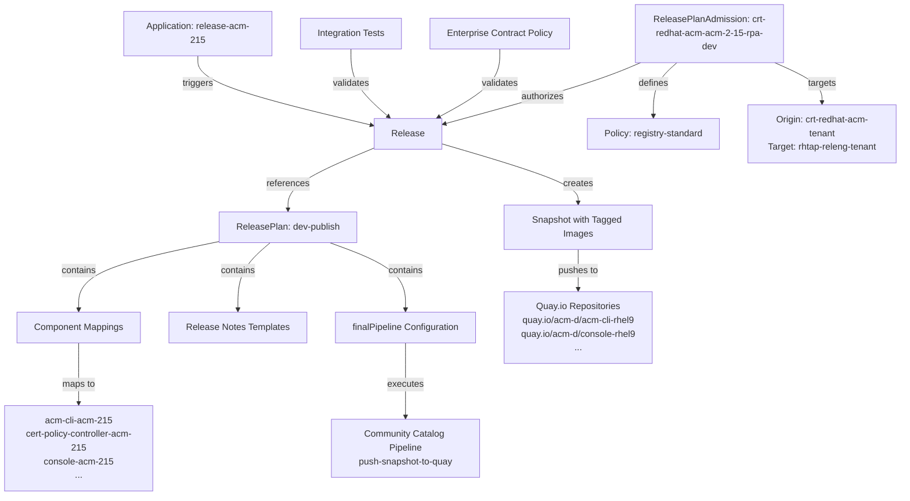

# Konflux Resource

```mermaid
graph TD
    A[Application: release-acm-215] -->|triggers| B[Release]
    B -->|references| C[ReleasePlan: dev-publish]
    D[ReleasePlanAdmission: crt-redhat-acm-acm-2-15-rpa-dev] -->|authorizes| B
    
    C -->|contains| E[Component Mappings]
    C -->|contains| F[Release Notes Templates]
    C -->|contains| G[finalPipeline Configuration]
    
    E -->|maps to| H[acm-cli-acm-215<br/>cert-policy-controller-acm-215<br/>console-acm-215<br/>...]
    
    D -->|defines| I[Policy: registry-standard]
    D -->|targets| J[Origin: crt-redhat-acm-tenant<br/>Target: rhtap-releng-tenant]
    
    G -->|executes| K[Community Catalog Pipeline<br/>push-snapshot-to-quay]
    
    B -->|creates| L[Snapshot with Tagged Images]
    L -->|pushes to| M[Quay.io Repositories<br/>quay.io/acm-d/acm-cli-rhel9<br/>quay.io/acm-d/console-rhel9<br/>...]
    
    N[Integration Tests] -->|validates| B
    O[Enterprise Contract Policy] -->|validates| B
    
    class E,F,G,H component
    class K,N,O pipeline
```
